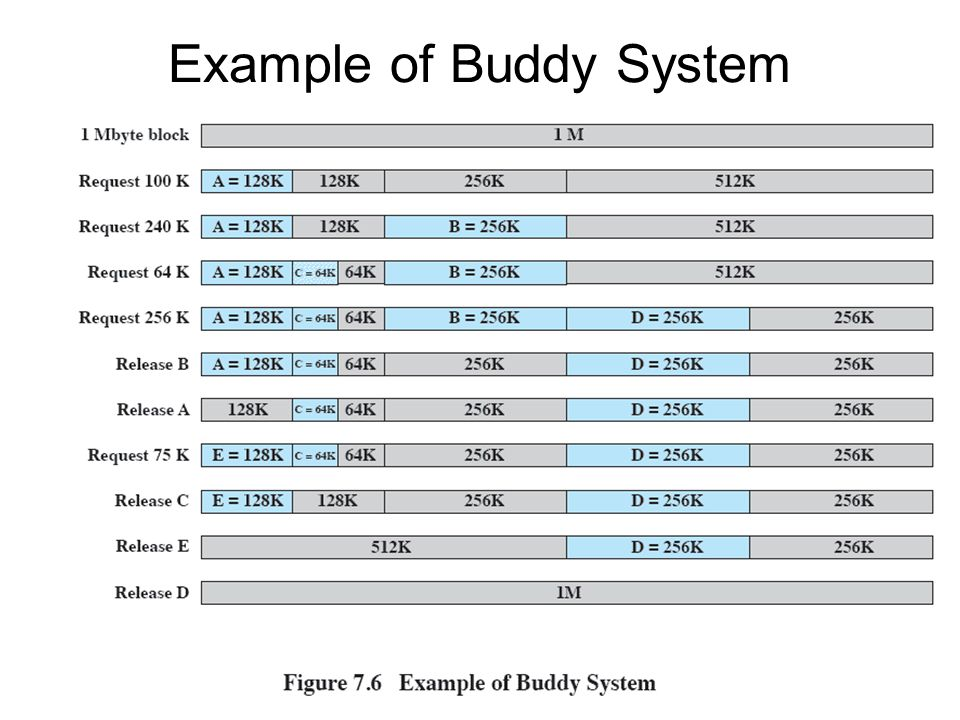

# BuddySystem

Console base C# Application of BuddySystem Memory Mnagement in Operating System

[Buddy memory allocation](https://en.wikipedia.org/wiki/Buddy_memory_allocation)

## Dependancies:

This project is created with Mono JIT compiler version 4.2.1 (Debian 4.2.1.102+dfsg2-7ubuntu4).
If you're not aware how to setup this project in Ubuntu OS just do

```sh
bash ./runonce.sh
```
it will install Mono along with its dependancies.

### compile program.

```sh
make compile
```
Then, to run the program do,

```sh
make run
```
for clean-up,

```sh
make clean
```

## Introduction

### The buddy system

  Buddy system of memory management attempts to be fast at allocating block of correct size and also, easy to merge adjacent holes. (We saw when you sort a free list by block size that allocations are fast, but merging is very difficult.) Exploits fact that computers deal easily with powers of two.

  We create several free block lists, each for a power-of-two size.

  So, for example, if the minimum allocation size is 8 bytes, and the memory size is 1MB, we create a list for 8 bytes hole, a list for 16 byte holes, one for 32-bytes holes, 64, 128, 256, 512, 1K, 2K, 4K, 8K, 16K, 32K, 64K, 128K, 256K, 512K and one list for 1MB holes.

  All the lists are initially empty, except for the 1MB list, which has one hole listed.

  All allocations are rounded up to a power of two---70K allocations rounded up to 128K, 15K allocations rounded up to 16K, etc.

### What a 'buddy' is

  The buddy system allows a single allocation block to be split, to form two blocks half the size of the parent block. These two blocks are known as 'buddies'. Part of the definition of a 'buddy' is that the buddy of block B must be the same size as B, and must be adjacent in memory (so that it is possible to merge them later).

  The other important property of buddies, stems from the fact that in the buddy system, every block is at an address in memory which is exactly divisible by its size. So all the 16-byte blocks are at addresses which are multiples of 16; all the 64K blocks are at addresses which are multiples of 64K... and so on.

  Not only must buddies be adjacent in memory, but the lower 'buddy' must be at a location divisible by their combined size. For example, of two 64K blocks, they are only buddies if the lower block lies at an address divisible by 128K. This ensures that if they are merged, the combined block maintains the property described above.

### Allocating memory

  To allocate, round the requested size up to a power of two (as mentioned), and search the appropriate list. If it is empty, allocate a block of twice the size, split it into two, add half to the free list, and use the other half. (This is recursive: the recursion stops when either we successfully find a block which we can split, or we find that we have reached the largest size of block and there are no free blocks available.)

  So if our 1MB memory is initially empty, and we want to allocate a 70K block, we round it up to 128K, and end up splitting the 1MB into two blocks, splitting one of them into two 256K blocks, splitting one of them into two 128K blocks, and finally allocating one of the 128K blocks to the user:

    Round 70K allocation to a power of 2: 128K.
    Are there any 128K blocks available?
    No. Allocate a 256K block.
        Are there any 256K blocks available?
        No. Allocate a 512K block.
            Are there any 512K blocks available?
            No. Allocate a 1MB block.
                Are there any 1M blocks available?
                Yes. Remove it from the list. 
            Split into two 512K blocks. Add one to the 512K list.
            Return the other 512K block. 
        Split into two 256K blocks. Add one to the 256K list.
        Return the other 256K block. 
    Split into two 128K blocks. Add one to the 128K list.
    Return the other 128K block. 

### Deallocating memory

  When we deallocate a block, we add it to the appropriate list, then check to see if its 'buddy' (the other chip from off the same old block) is also on the list. If so, we can merge to two buddies, and add a block twice the size to the next higher list. Again, this recursively merges all buddies which can be merged. So assuming there is no other allocated memory in the system, and we wish to deallocate the block we allocated above:

    Is the buddy of this block on the 128K list?
    Yes. Remove the buddy from the 128K list.
    Merge the two blocks and deallocate the merged (256K) block.
        Is the buddy of this 256K block on the 256K list?
        Yes. Remove the buddy from the 256K list.
        Merge the two blocks and deallocate the merged (512K) block.
            Is the buddy of this 512K block on the 512K list?
            Yes. Remove the buddy from the 512K list.
            Merge the two blocks and deallocate the merged (1M) block.
                Is the buddy of this 1M block on the 1M list?
                No. Add this block to the 1M list. 

### Advantages, disadvantages

  Buddy system has advantages that it is fast to allocate memory, and fast to deallocate... but it wastes a lot of space in internal fragmentation, since all requests are rounded up to a power of two. On average 20% is wasted (apparently).

  Note that the buddy system is useful. Linux uses the buddy system to manage allocation of memory, possibly because it is allocating many structures which are already powers of two, like frames.
  
  [Source](http://dysphoria.net/OperatingSystems1/4_allocation_buddy_system.html)

  

### P.S:
We all knows well "Perfect Software is Myth :)"
So there is room for improvements. you're legally entitled to use, re-distribute, make chages & improvements.
